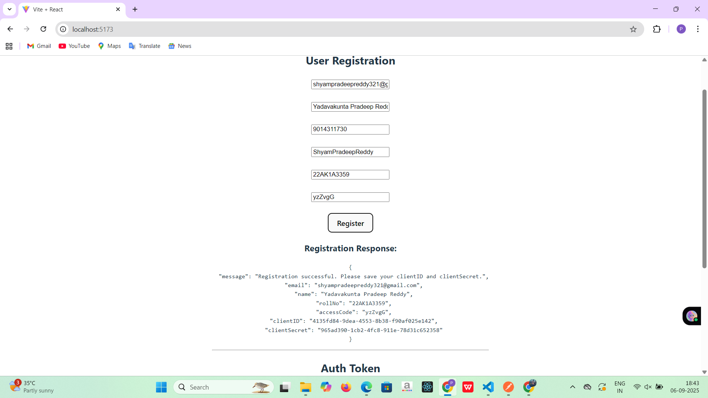
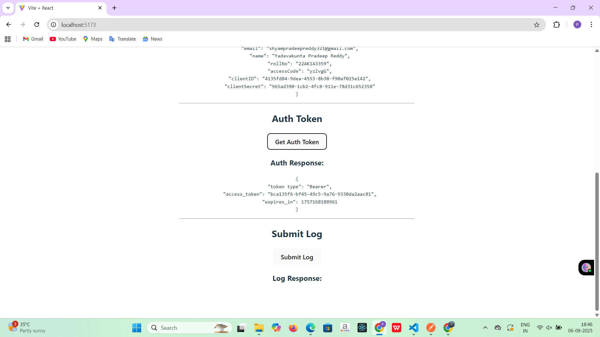
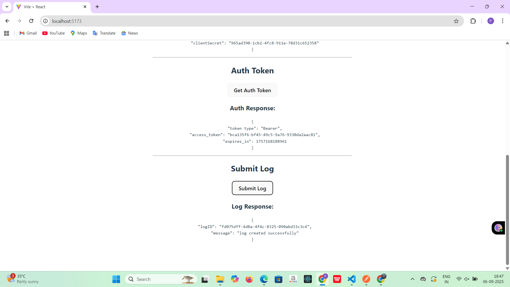

# **Project Title:**  
**Affordmed API handling through middlewares and complete developed webapp for register, login.**

---

## **Tech Stack:**  
**React + Express (Node.js) Full Stack Developer**

---

## **1. Project Overview:**  
- **Responsive store UI built with React** for browsing farm products.  
- **Backend APIs using Express** for registration, login, and logs.  
- **Deployed on AWS** with role-based access control and product recommendations.

---

## **2. System Architecture:**  

**Frontend (React):**  
- Displays product catalog and user registration form.  
- Sends API requests to the backend.

**Backend (Express):**  
- APIs for registration, authentication, and logs.  
- Uses in-memory storage for demonstration purposes.

---

## **3. Backend API:**  

**a. Registration API (POST):**  
- Receives user details and returns **clientID** and **clientSecret**.  
- Prevents duplicate registration.

**b. Authorization API (POST):**  
- Validates user credentials and returns an **access token**.

**c. Log API (POST):**  
- Accepts error logs and returns a **logID** and success message.

---

## **4. Frontend Workflow:**  
1. User fills registration form → Sends data to backend → Receives **clientID** and **clientSecret**.  
2. Uses credentials and **clientID**, **clientSecret** to get an auth token from backend.  
3. Sends log data to backend → Receives **logID** confirmation.

---

## **5. Middleware Login Procedure:**  
- Extract **Bearer token** from request headers.  
- Validate token and check expiration.  
- Grant access if valid, reject otherwise.

---

## **6. Conclusion:**  
- Simple React and Express platform with user **registration**, **login**, and **logging**.  
- Middleware ensures **API security**.
- 
